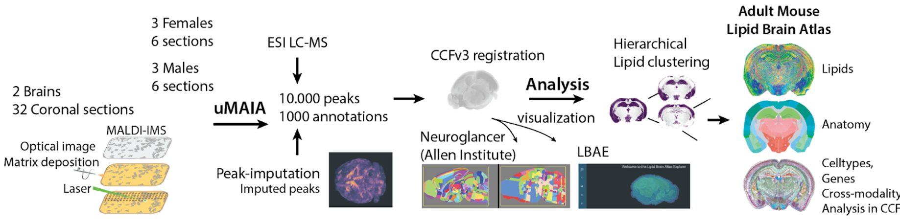
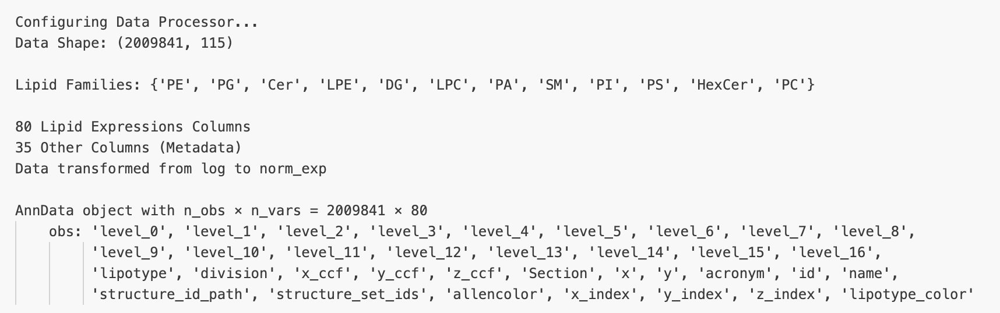

LBADataHandler Documentation
============================

LBA - Lipid Brain Atlas and MALDI-MSI Data
-----------------------------------------
MALDI-MSI (Matrix-Assisted Laser Desorption/Ionization Mass Spectrometry Imaging) is a powerful technique at the intersection of mass spectrometry and spatial tissue analysis. By preserving the spatial information of molecules within biological samples, MALDI-MSI offers insights into the distribution of biomolecules across tissue sections (the brain in this case).

This acquisition technique works by applying a chemical matrix to a thin tissue section and using laser irradiation to ionize both matrix and sample molecules. As the mass spectrometer analyzes these ions, it maintains their original spatial coordinates, generating position-specific mass spectra. This allows researchers to create detailed molecular maps of tissue samples, revealing the distribution and concentration of various compounds.

A significant challenge in MALDI-MSI analysis has been noise measurement and consistent annotation across brain sections. To address this, the data processing pipeline employs `uMAIA <https://github.com/lamanno-epfl/uMAIA>`_. The processed data is then registered to the Common Coordinate Framework (CCFv3) from the Allen Brain Atlas, enabling standardized spatial analysis and comparison.

This comprehensive processing pipeline forms the foundation of the Adult Mouse Lipid Brain Atlas (LBA), providing a standardized framework for lipid analysis across brain sections. The LBA project, curated by the `Laboratory of Brain Development and Biological Data Science at EPFL <https://www.epfl.ch/labs/nsbl/>`_, aims to provide a standardized reference system for lipidomic data. As an atlas, it emphasizes the precise localization of lipid expressions within the brain, which is crucial for understanding the organ’s functional architecture and the interactions between its components.

Input Data Requirements
-----------------------

The class processes MALDI-MSI lipidomics data structured as a pandas DataFrame where:

1. **Row Structure**: Each row represents a voxel (3D pixel) from brain slices in the dataset.
2. **Column Structure**:
   - **Lipid Expression Columns**
     - Format: ``[Family] [Carbon]:[Double_Bonds]``
     - Example: ``PC 36:0`` where:
       - ``PC``: Lipid family abbreviation, beginning with a capital letter
       - ``36``: Number of carbon atoms
       - ``0``: Number of double bonds
     - Naming must follow this convention for proper lipid family recognition

   - **Metadata Columns**
     - All non-lipid columns
     - Include:
       - Spatial coordinates (x, y, z) in the ABA common coordinate framework
       - Brain slice identifier
       - Additional experimental metadata

Note: The class automatically identifies lipid columns based on their naming pattern, treating all other columns as metadata.

Class Arguments
---------------

- ``df``: pandas DataFrame containing lipid expression data and metadata
- ``masks_path``: Directory path for storing mask data and generated .lmt files (default: ``./masks``)
- ``initial_format``: Input data format ('log', 'exp', 'norm_exp') (default: ``log``)
- ``final_format``: Desired output format ('log', 'exp', 'norm_exp') (default: ``norm_exp``)
- ``amplify``: Boolean flag to multiply normalized data by 1000 to mimic gene raw counts (default: ``True``)

Pre-Processing Pipeline
-----------------------
1. **Default Initialization**:
   - ``__config__``: Configuration happens and raw data are loaded.
   - ``_extract_lipid_families``: From the data, all the possible lipid families are extracted and saved as attribute.
   - ``__fill_lipid_meta_cols``: Lipid columns and metadata columns are extracted.
   - ``_transform_data``: Transition from initial to final format happens.
   - ``_raw_counts_like``: Raw-counts (*1000) amplification happens (if necessary)

2. **Additional capabilities**:
   - ``create_family_lmt``: The class generates an .lmt (Lipid Matrix Transposed) file that maps lipid families to their associated lipids (tab-delimited format):
     ::
     
       FamilyA    Lipid1    Lipid2
       FamilyB    Lipid3    Lipid4

   - ``to_anndata``: Convert processed data to AnnData format.

The verbose output while processing data will appear as follows:

